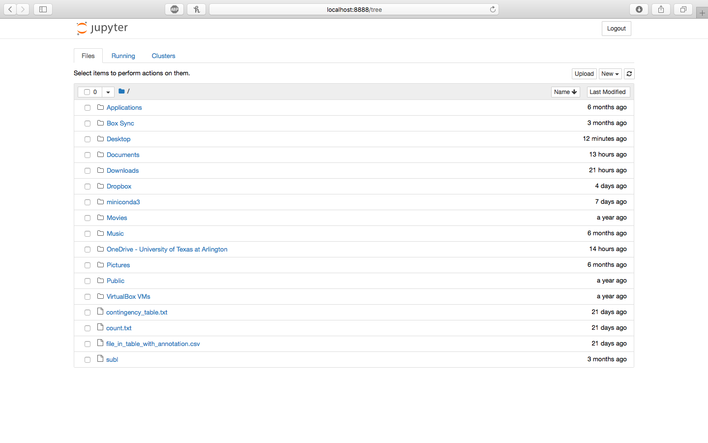
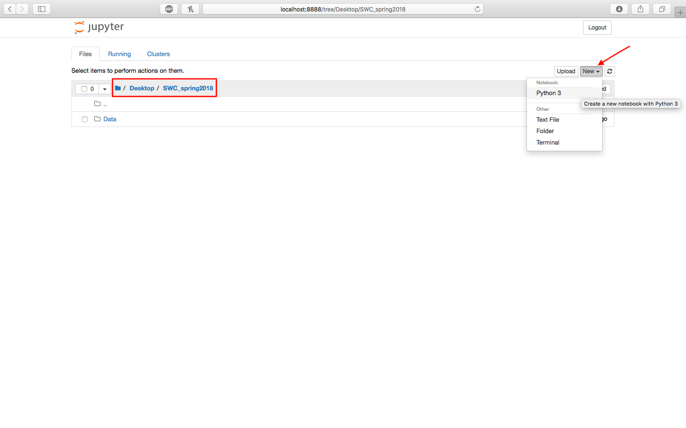
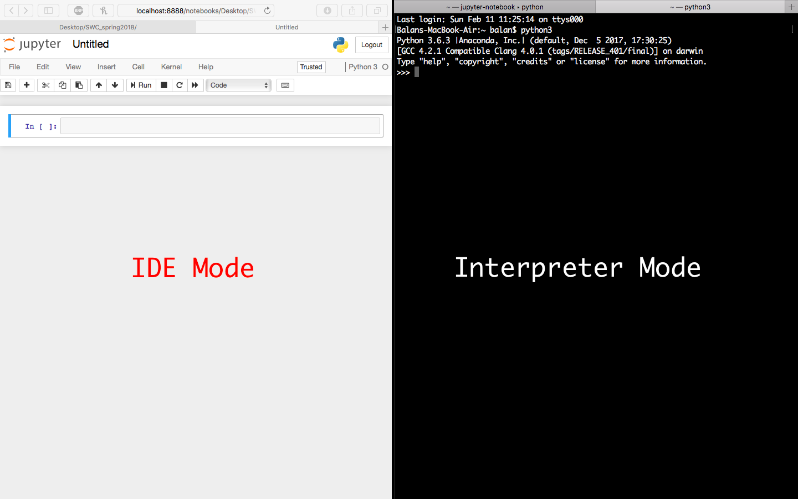
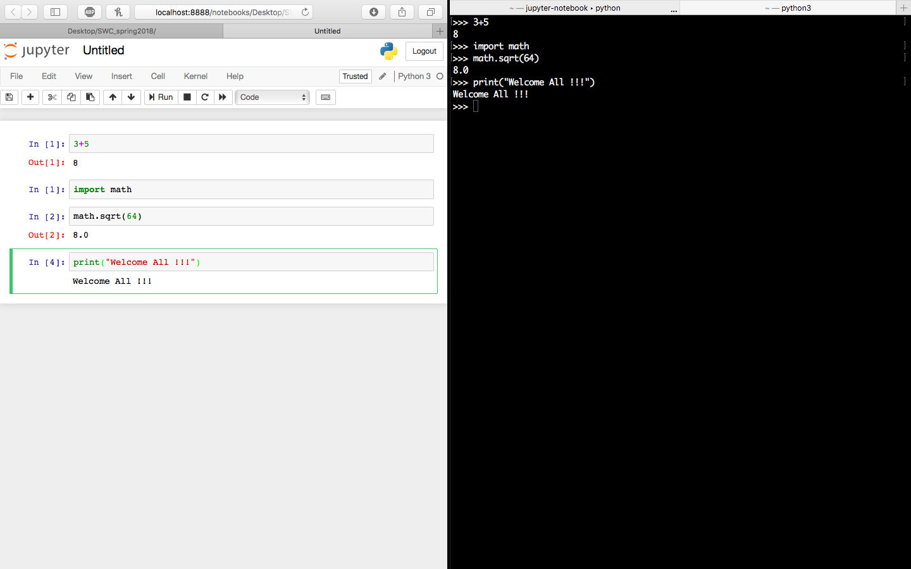
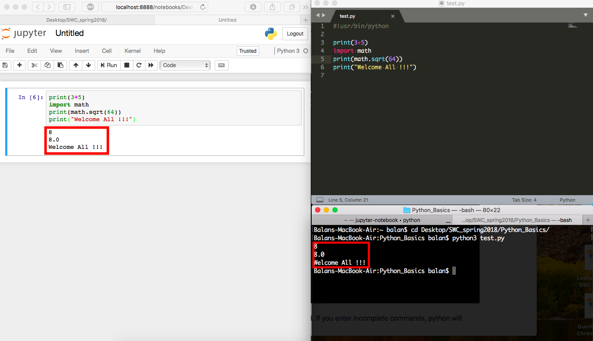
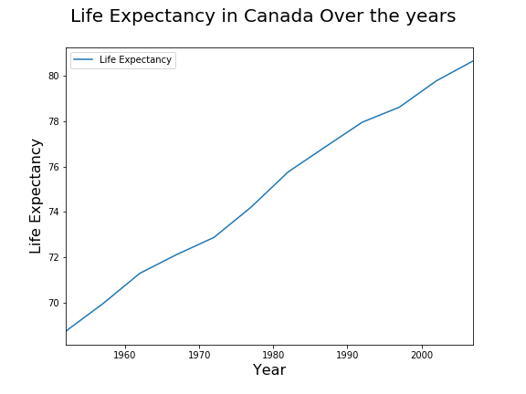

Software Carpentry Workshop: 
============================
Lesson1: Introduction to Python
===============================
SWC workshop, February 2018  
Instructor: Balan Ramesh  
Time: 3 hours  

---

Good morning!
Before we start working with python, let's make a folder where you will save all your work during this workshop.

Let's make a folder `SWC_spring2018` on your Desktop. We will be working with this folder for the next 2 days so it is better if you leave it on the Desktop where it is easily accesible. It also helps for everyone to have the folder in the same location as it will make it easier to navigate to your files when we start using command line interface later today.

:+1: Do it with students and make sure everyone is with you - put up red sticky notes if having problems, green when done with the task. 

Now let's download datasets (Data.zip) for the workshop and put it in `SWC_spring2018` folder.

[Dataset](https://raw.githubusercontent.com/AnnaWilliford/2017-11-11-UTA/gh-pages/workshop/SWC_fall2017/Data.zip)

When you unzip this file, you should have `Data` folder with `ByCountry` folder and `gapminder.txt` file in it.


Finally, let's make another folder called  `Python_basics` inside `SWC_spring2018` folder. This is where we will save all files for this lesson.

:+1: Do it with students and make sure everyone is with you - put up red sticky notes if having problems, green when done with the task.


Now we are ready to work with Python.

### Learning objectives of this workshop

- Understand benefits of using Python
- Understand how to work with Jupyter Notebook
- Understand how to go get data from Excel to Python
- Understand building blocks of Python language
- Understand how to extract parts of the dataset
- Understand how to write simple Python scripts

Ultimately, by the end of this workshop, you can create your own reports as a Markdown file or HTML file or pdf file to present it to your superiors.

:hushed::hushed::hushed:
```
=======================================
Get reports from whosoever is doing it
=======================================
```

You can achieve the following graphs and leave a good impression.

:astonished::astonished::scream:
```
=================================================
Get visualization graphs from whosoever is doing it
=================================================
```

## Introduction to Python and Jupyter Notebook

### Why Python ?

Python is a general purpose programming language that supports rapid development of scripts and applications.


Python’s main advantages:

* Open Source software, supported by Python Software Foundation
* Available on all platforms
* It is a general-purpose programming language
* Supports multiple programming paradigms
* Very large community with a rich ecosystem of third-party packages

### Jupyter Notebook as IDE for Python

We will be working with Python using Jupyter Notebook. This is a piece of software (also known as integrated development environment, IDE ) that makes working in Python much easier. 

:confused::confused::confused:
> How to open jupyter notebook in different platforms !!!

Now let's open Jupyter Notebook by typing `jupyter-notebook` in the terminal/console.

Jupyter Notebook opens in your default browser with a list of files and directories in the home directory with this URl `http://localhost:8888/tree`  



For this workshop, we will have all our files in `SWC_spring2018`. Navigate `Home-->Desktop-->SWC_spring2018-->Python_Basics` and hit New and click Python 3 to create a new file.



:+1: Do it with students and make sure everyone is with you - put up red sticky notes if having problems, green when done with the task.

This opens up to the Notebook User Interface (UI). This has three areas.

* Menu 
* Toolbar
* Notebook area and cells

So if a cell is highlighted in `green` :green_heart:, it means the cell is in `edit mode`. If the cell is highlighted in `blue` :blue_heart:, it means the cell is in `command mode`.
 Now let us try the following commands one by one in `edit mode`. Type `3+5` and hit <kbd>Shift</kbd>+<kbd>Enter</kbd>

```python
            >>> 3+5
            >>> import math
            >>> math.sqrt(64) 
            >>> print("Welcome All !!!")
```

Similarly, we have interpreter mode in python which opens as follows

:confused::confused::confused:
> How to open python in different systems


### Interpreter Mode

Now let us see how interpreter mode works. Open a new tab in the terminal and type `python3` and hit enter.
This should open python in interpreter mode with `>>>` as shown.



When you type commands in the terminal/console window and press 'ENTER', they are executed immediately and the output is displayed. Here are few examples:  

```python
            >>> 3+5
            >>> import math
            >>> math.sqrt(64) 
            >>> print("Welcome All !!!")
```
            
            

Symbol `>>>` means that the python is ready for the next command. If you enter incomplete commands, python will show SyntaxError or a Nameerror. 

## IDE for Python vs Interpreter Mode/Scripting Mode

Functionality is all the same. But the advantage of Jupyter Notebook is that it helps us write reports using Markdown file and supports in-text code blocks that are executed while rendering to HTML or pdf files.



For this workshop we will be working with Jupyter Notebook. 

:+1: Do it with students and make sure everyone is with you - put up red sticky notes if having problems, green when done with the task.

**Now lets get started**

## 2. Building blocks of Python

Let's work in edit mode in Jupyter from now on so that you will have the record of all commands we used in this lesson.

### Variables/objects

One of the main concepts of any programming language is a notion of a variable. Variables are created to store values for future use.
To create a variable in python, use `=` as assignment operator:

```python
a = 5
print(a)
DNA = "ACTGATGCTAGC"
print(DNA)
```

**Challenge 2.1**
    
```python
=====
TASK: What will be the value of each  variable  after each statement in the following code?
=====
mass = 47.5
age = 122
mass = mass * 2.3
age = age - 20
height = height + 20      
```

As you can see, a variable is assigned a value equal to the value of the evaluated expression on the right side of the assignment operator. 

**A note on variable names:**
* NO SPACES in names
* DO NOT START with numbers
* Names should be MEANINGFUL - help yourself and others to understand your code! 

### Working with environment

#### List all variable defined in your environment

```python
who
```

#### Delete a specific variable in your environment

```python
del DNA
del a
```

#### To delete all the variables

```python
reset
```

### Functions

In general, a function takes an input and transforms it according to the function's definition(rules). You can recognize functions in python by the presence of parantheses. Objects in parantheses are called function's `arguments`.

#### Print is a widely used function

```python
DNA = "ATGCATGCT"
print(DNA)
```

- Here `print()` is a function.
- `(DNA)` is an argument to the function.

#### To Apply square root function

```python
import math
a = 64
math.sqrt(a)
sqrt_a = math.sqrt(a)
print(sqrt_a)
```

- `math` is the module which has square root function. A module is a collection of several related functions. 
- `sqrt()` is the function
- `(a)` is the argument to the function.
- The square root of the `a` is now assigned to a new variable named `sqrt_a`
- `print()` function takes `sqrt_a` as argument and displays it to the user.

### Help functions

Question mark followed by the name of the module/function provides information about the module.

```python
?math.sqrt()
```

### Present directory is given by

```python
pwd
```

## Data types

Let's assign value of 45 to a variable `age`. We just created the smallest object in R:

```python
dna = "ATCGTCAC"

#some useful functions to know more about the object 
len(dna)

age = 45

#some useful functions to know more about the object 
a = str(age)
```

Variables can hold values of various types. Most common data types:

  * Int
  * Float
  * Str
  * Boolean

  
For example: What data type is stored in `score` variable?
```python
score = 79
type(score)
type(str(score))
```

Sometimes you will need to convert between data types. There are functions that do that:  
  * int()
  * float()
  * str()
  * bool()
  
The last expression in the above example of nested function. Nested functions are very common in python, but are very difficult to understand at first. You can always split nested function into a series of single function calls. Remember that the variable inside the most inner paranthesis is an argument(input)for the function that will be evaluated first.

**Challenge 2.1:* Learn how to read the output of nested help functions **

```python
TASK: Break the following expression into multiple single function calls.
You will need to assign the output of each function to a variable that
will serve as an input(argument) for the next function. 
What is the value of each variable? What does each function do? 
Assign: `score = 79`

type(str(type(float(score))))
```

The conversion between data types is not always possible - why? Let's see what happens here:

```python
score = 79
type(score)
type(str(score))
##################
dna = "TCAGTCGATC"
type(dna)
type(int(dna))
```

:worried::worried::worried:
> I can understand that the conversion is not possible. I also see a value error. But I dont understand `Why`. Why is it not converting?

## Operators

Now lets move on to different types of operators in python and condition statements. 

### Basic Operators

| S.No. | Operator | Function  
|:------|:---------|:--------- 
|1.    |  *       |  Multiplication 
|2.    |  /       |  Division
|3.    |  +       |  Addition
|4.    |  -       |  Subtraction
|5.    | **       |  Exponentition
|6.    | %        |  Modulo (Provides the remainder)

```python
a = 5
b = 7
a * b
a / b
a + b
a - b
a ** b
a % b
```

### Comparision Operators

| S.No. | Operator | Function  
|:------|:---------|:--------- 
|1.    |  >       |  Greater than
|2.    |  >=      |  Greater than or equal to
|3.    |  <       |  Lesser than
|4.    |  <=      |  Lesser than or equal to
|5.    |  ==      |  Equal to
|6.    |  !=      |  Not Equal to

```python
a = 5
b = 7
a > b
a < b
a >= b
a <= b
a == b
a != b
```

## Condition statements:

If, elif and else are condition statements in python. These statements evaluate a condition and depending on whether the condition is true or not, they descend to the commands indented within these statements.

**if and else**

```python
a = 5
b = 7
if a < b:
  print(a,"is smaller than",b)
else:
  print(a,"is greater than",b)
```

**if, elif and else**

```python
a = 5
b = 7
if a < b:
  print(a,"is smaller than",b)
elif a == b:
  print(a,"is equal to", b)
else:
  print (a,"is greater than",b)
```

- The number of elif statements can be increased.
- Condition statements should end with a colon.
- Block of code within these conditions should be indented.

#### Membership Operators

| S.No. | Operator | Function  
|:------|:---------|:--------- 
|1.     |   in     | True if it finds a variable in the specified sequence and false otherwise.
|2.     |   not in | True if it does not finds a variable in the specified sequence and false otherwise.

For example:

```python
dna= "catgctagtcgangctagtgcngtaNNcgtnnncgatgcta"
if "n" in dna :
   nbases=dna.count("n")
   print("dna sequence has %d undefined bases " % nbases)
else:
   print("dna sequence has no undefined bases")
```

#### Logical Operators

| S.No. | Operator | Function  
|:------|:---------|:--------- 
|1.     |   and    | True if both conditions are true
|2.     |   or     | True if at least one condition is true
|3.     |   not    | True if condition is false

```python
dna= "agctgtcatgntacgtgcaNNacgtgcatcnnnn"
if "n" in dna or "N" in dna:
   nbases=dna.count("n")+dna.count("N")
   print("dna sequence has %d undefined bases " % nbases)
else:
   print("dna sequence has no undefined bases")
```

### Looping in Python

#### while loop

The while loop repeats a block of commands/instructions as long as a given condition is True. Each repetition is called an iteration of the loop.

```python
n = 1

while n < 4:
	print(n)
	n = n + 1
```

#### for loop

The for loop is another way to iterate over a list or over a range of values. A for loop automatically assigns a variable to the current element being iterated on.

```python
for i in range(1, 11):
  print(i)
```

## Data structures 

The small objects can be combined to build larger objects. Look at the gapminder dataset again. Our smallest objects can be used to represent a single element in the dataset, like individual year, or individual country, but what would be the simplest object that you can make with multiple elements?

#### List

List is a data structure in python that holds different data types as a single list as an ordered sequence. Each value in the list is separated by comma (,) and is indexed. Indexing starts from 0.

For example:

```python
list = [5,6.7,"Texas"]
type(list)
```
 - Notice the use of square brackets.
 
 |list   |= |5 | 6.7 | "Texas" |
 |:----- |:-|:-|:----|:--------|
 ||From Left||
 |Index  |= |0 | 1   |  2      |
 ||From Right||
 |Index  |= |-3| -2  |  -1     |
 
```python
list = [5,6.7,"Texas"]
type(list[0])
type(list[1])
type(list[2])
```
Now if you wanted to change a value say 6.7 to 5.4, you can do that. This property of the list is called `**mutable property**`

```python
list = [5,6.7,"Texas"]
list[1] = 5.4
list
```
 
#### Tuple

Tuples are similar to list. They can hold different data types as a list of values separated by comma(,).

For example:

```python
tuple = (5,6.7,"Texas")
type(tuple)
```

 - Notice the use of simple brackets or parantheses.
 
 |tuple  |= |5 | 6.7 | "Texas" |
 |:----- |:-|:-|:----|:--------|
 ||From Left||
 |Index  |= |0 | 1   |  2      |
 ||From Right||
 |Index  |= |-3| -2  |  -1     |
 

Now if you wanted to change a value say 6.7 to 5.4, you **CANNOT** do that. This property of the tuples makes them `**immutable**`

```python
tuple = (5,6.7,"Texas")
tuple[1] = 5.4
```

```
---------------------------------------------------------------------------
TypeError                                 Traceback (most recent call last)
<ipython-input-91-6b513665c9a0> in <module>()
----> 1 tuple[1] = 5.4

TypeError: 'tuple' object does not support item assignment
```

#### Dictionary

A dictionary is a container that holds pairs of objects - keys and values. Dictionary is not ordered or indexed as lists and tuples. Each value is accessible by its key and key can only be either a string or an integer data type. It can not be a list.

```python
dictionary = {1:"one",2:"two",3:"three","dna":"atcgatgctagcta","protein":"hyrglkvmhyglma"}
dictionary["dna"]
dictionary[3]
for (key,value) in dictionary.items():
    print (key,"--->",value)
```

**CHALLENGE 2.2** 

TASK: Try to create a list named 'myOrder' that contains the 
    following data structures as list elements:

-- Element 1 is a str list of length 4 that 
    lists the menu items you ordered from the restaurant: 
    chicken, soup, salad, tea.

-- Element 2 is a str list that describes menu items
    as "liquid" or "solid".

-- Element 3 is a int list that records the cost of each menu item:
    4.99, 2.99, 3.29, 1.89.

* Hint: Define your elements first, then create a list with them.

**CHALLENGE 2.2 Answer**

```python
myOrder=[]
menuItems = ["chicken", "soup","salad","tea"]
menuType = ["solid","liquid","solid","liquid"]
menuCost = [4.99,2.99,3.29,1.89]
myOrder=[menuItems,menuType,menuCost]
```

#### Data Frame with Pandas
  
One of the best options for working with tabular data in Python is to use the Python Data Analysis Library (a.k.a. Pandas). The Pandas library provides data structures, produces high quality plots with matplotlib and integrates nicely with other libraries that use NumPy (which is another Python library) arrays.

Python doesn’t load all of the libraries available to it by default. We have to add an import statement to our code in order to use library functions. To import a library, we use the syntax `import libraryName`. If we want to give the library a nickname to shorten the command, we can add as nickNameHere. An example of importing the pandas library using the common nickname pd is below.

```python
import pandas as pd
```

* Let's go back to gapminder dataset. Could you make an informative guess about how this data structure can be represented in python?

* Yes! It is a list of tuples of equal length, or a data frame. Data frames are extremely useful data structures as they represent table-like datasets. Let's look at our myOrder list to see if we can make data frame out of it. Is the list we just made suitable for a data frame? Yes, the elements of the list are vectors of equal size.

Previously we used `list[]` to combine our elements:

```
d = {'menuItems':["chicken", "soup","salad","tea"],'menuType':["solid","liquid","solid","liquid"],'menuCost':[4.99,2.99,3.29,1.89]}
myOrder = pd.DataFrame(data=d)
myOrder
```

#### Importing the data using Pandas  

```python
### For tab separated file
my_file = pd.read_table("gapminder.txt")

### For comma separated file
my_file = pd.read_csv("gapminder.csv")

### For excel file
my_file = pd.read_excel("gapminder.xlsx")
```

##### Slicing Rows and Columns using indexing
Now lets look at the top few lines and last few lines in the df.

```python
### Read in the first 10 lines of data frame
file_dataframe = my_file.head(10)

### Read in the last 10 lines of data frame
file_dataframe = my_file.tail(10)
```

:hushed::hushed::hushed:

What if you wanted specific set of lines from your data frame?

```python
my_file.loc[10:15]
my_file.iloc[10:15]

#### I can specify the columns this way
my_file.iloc[10:15,2]
```

**loc is label based indexing** or
**iloc is positional indexing**

What does this do?

```python
my_file.iloc[10:15,1:3]
```

##### Subsetting using a criteria

Now lets try and select the all the rows and columns of "Sweden" only.

```python
my_file[my_file.country == "Sweden" ]
```

**Challenge 3.1** Play with gapminder dataset:

```
TASK: Answer the following questions about `myData` object

1. Can you extract 3rd and 5th column of the dataset?
2. Can you extract the list of countries in this dataset?
### Hint: use unique(). ###
3. Can you get a part of this dataset that includes information about Sweden?
4. Can you extract all countries for which life expectancy is below 70?
5. Can you make a new column that contains population in units of millions of people?
```

**Challenge 3.1** Answers

```
1. my_file.iloc[:,[2,4]]
2. my_file.country.unique()
3. my_file[my_file.country == "Sweden" ]
4. my_file[my_file.lifeExp < 70]
5. my_file["PopM"] = pd.Series((my_file.iloc[:,4])/(10^6), index = my_file.index)
```
## Writing Simple Scripts in Python

An Python script (or any other script) is a series of commands that are executed in the order they are written. The commands that we have executed one by one in python can be written to a text file and then executed all at once by running the file (which is now an pyhton script). Python scripts usually have .py extensions. Here is an example of a simple python script that will plot life expectancy over years for Canada.

```python
##This is  PlotLifeExp.py script

#Import pandas and pylab
import pandas as pd
import pylab

#read data into python
my_file = pd.read_table("gapminder.txt")

#my_file is a dataframe - check

#select information about Canada
Canada = my_file[my_file.country == "Canada"]

#Canada is a new dataframe

#plot lifeExp 
Canada.plot.line(x='year',y='lifeExp',label = "Life Expectancy",figsize=(8, 6))
plt.suptitle('Life Expectancy in Canada Over the years', fontsize = 20)
plt.xlabel('Year', fontsize = 16)
plt.ylabel('Life Expectancy', fontsize = 16)
pylab.show()
```


You might want to save your plot as .png image. This requires only slight modification of our script.

```python
##This is  PlotLifeExp.py script

#Import pandas and pylab
import pandas as pd
import pylab

#read data into python
my_file = pd.read_table("gapminder.txt")

#my_file is a dataframe - check

#select information about Canada
Canada = my_file[my_file.country == "Canada"]

#Canada is a new dataframe

#plot lifeExp 
Canada.plot.line(x='year',y='lifeExp',label = "Life Expectancy",figsize=(8, 6))
plt.suptitle('Life Expectancy in Canada Over the years', fontsize = 20)
plt.xlabel('Year', fontsize = 16)
plt.ylabel('Life Expectancy', fontsize = 16)
plt.savefig("PlotLifwExp.png")
```

**Challenge 3.2**  Write your own python script
Write a script to calculate mean gdpPerCap for African and European countries.
Try to make a barplot to display your results.

You might need to read help for 'mean' and 'plot' functions
mean()
plot(type ='bar')

